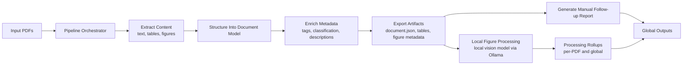
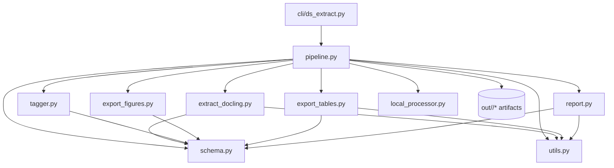
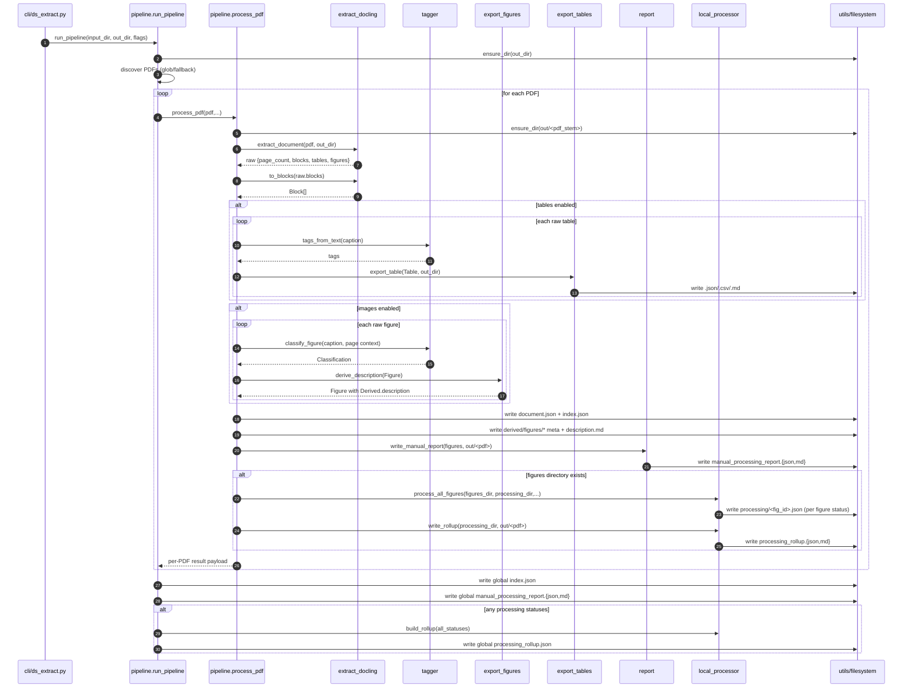

# Architecture Overview

## High-Level Block Flow

```mermaid
flowchart LR
  A[Input PDFs] --> B[Pipeline Orchestrator]
  B --> C[Extract Content<br/>text, tables, figures]
  C --> D[Structure Into Document Model]
  D --> E[Enrich Metadata<br/>tags, classification, descriptions]
  E --> F[Export Artifacts<br/>document.json, tables, figure metadata]
  F --> G[Generate Manual Follow-up Report]
  F --> H[Local Figure Processing<br/>local vision model via Ollama]
  H --> I[Processing Rollups<br/>per-PDF and global]
  G --> J[Global Outputs]
  I --> J[Global Outputs]
```

## File Relationships

```mermaid
graph TD
  CLI[cli/ds_extract.py] --> P[pipeline.py]

  P --> E[extract_docling.py]
  P --> T[tagger.py]
  P --> EF[export_figures.py]
  P --> ET[export_tables.py]
  P --> R[report.py]
  P --> LP[local_processor.py]
  P --> S[schema.py]
  P --> U[utils.py]

  E --> S
  E --> U

  T --> S
  EF --> S
  ET --> S
  ET --> U
  R --> S
  R --> U

  P --> OUT[(out/<pdf>/* artifacts)]
```

## End-to-End Sequence

```mermaid
sequenceDiagram
  autonumber
  participant CLI as cli/ds_extract.py
  participant P as pipeline.run_pipeline
  participant PP as pipeline.process_pdf
  participant E as extract_docling
  participant T as tagger
  participant EF as export_figures
  participant ET as export_tables
  participant R as report
  participant LP as local_processor
  participant U as utils/filesystem

  CLI->>P: run_pipeline(input_dir, out_dir, flags)
  P->>U: ensure_dir(out_dir)
  P->>P: discover PDFs (glob/fallback)

  loop for each PDF
    P->>PP: process_pdf(pdf,...)
    PP->>U: ensure_dir(out/<pdf_stem>)

    PP->>E: extract_document(pdf, out_dir)
    E-->>PP: raw {page_count, blocks, tables, figures}
    PP->>E: to_blocks(raw.blocks)
    E-->>PP: Block[]

    alt tables enabled
      loop each raw table
        PP->>T: tags_from_text(caption)
        T-->>PP: tags
        PP->>ET: export_table(Table, out_dir)
        ET->>U: write .json/.csv/.md
      end
    end

    alt images enabled
      loop each raw figure
        PP->>T: classify_figure(caption, page context)
        T-->>PP: Classification
        PP->>EF: derive_description(Figure)
        EF-->>PP: Figure with Derived.description
      end
    end

    PP->>U: write document.json + index.json
    PP->>U: write derived/figures/* meta + description.md
    PP->>R: write_manual_report(figures, out/<pdf>)
    R->>U: write manual_processing_report.{json,md}

    alt figures directory exists
      PP->>LP: process_all_figures(figures_dir, processing_dir,...)
      LP->>U: write processing/<fig_id>.json (per figure status)
      PP->>LP: write_rollup(processing_dir, out/<pdf>)
      LP->>U: write processing_rollup.{json,md}
    end

    PP-->>P: per-PDF result payload
  end

  P->>U: write global index.json
  P->>U: write global manual_processing_report.{json,md}
  alt any processing statuses
    P->>LP: build_rollup(all_statuses)
    P->>U: write global processing_rollup.json
  end
```
